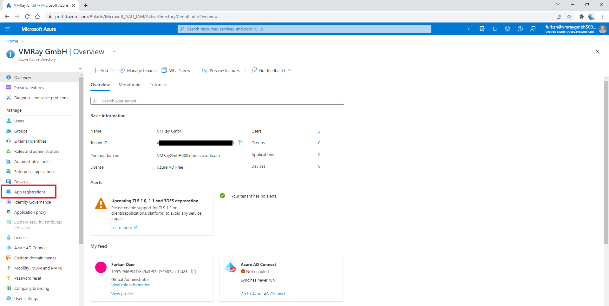
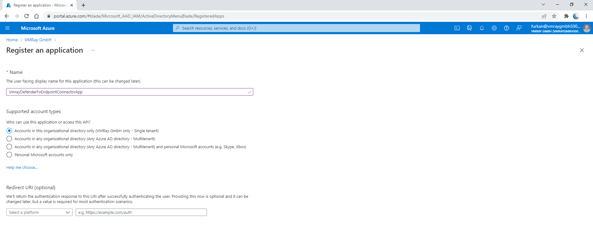
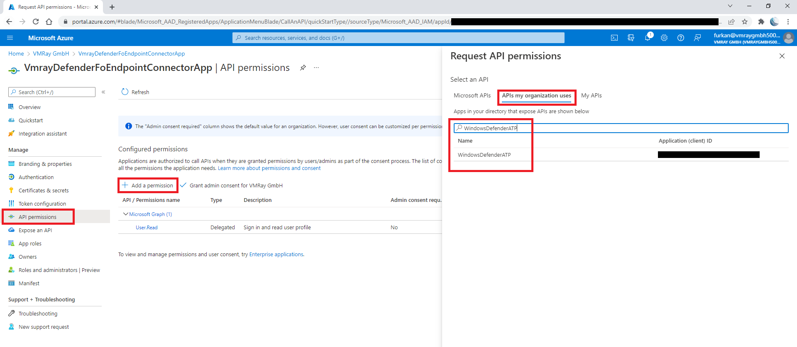
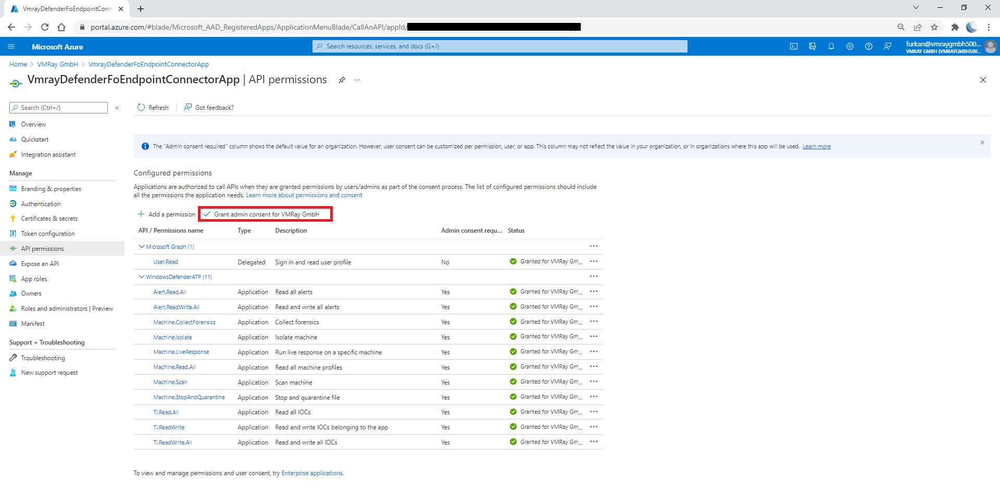
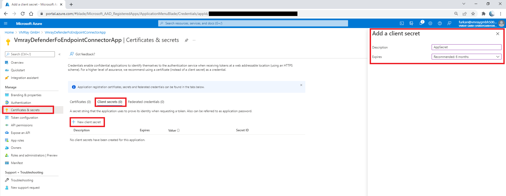
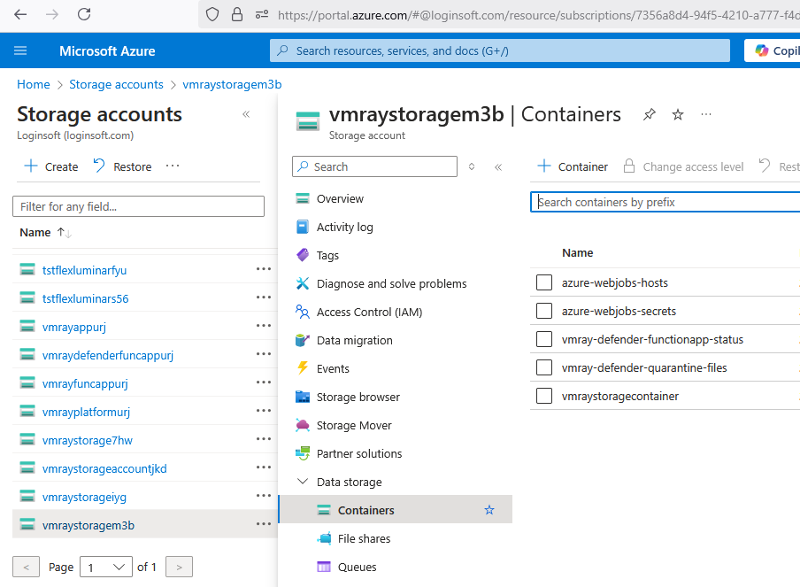
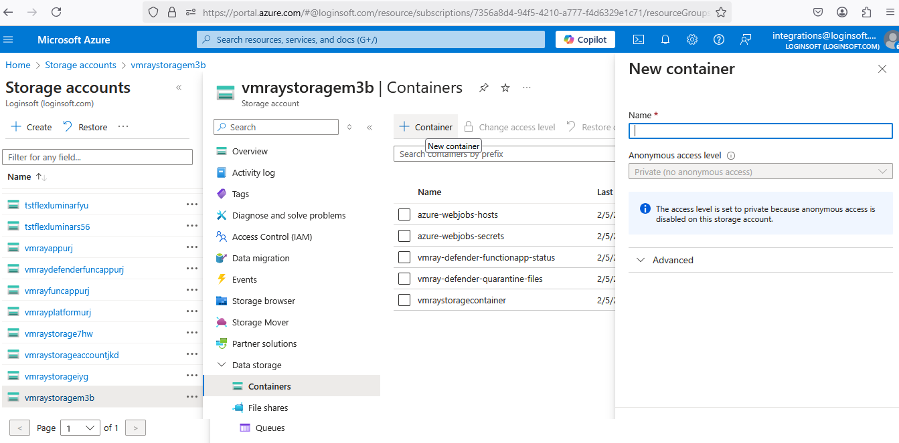
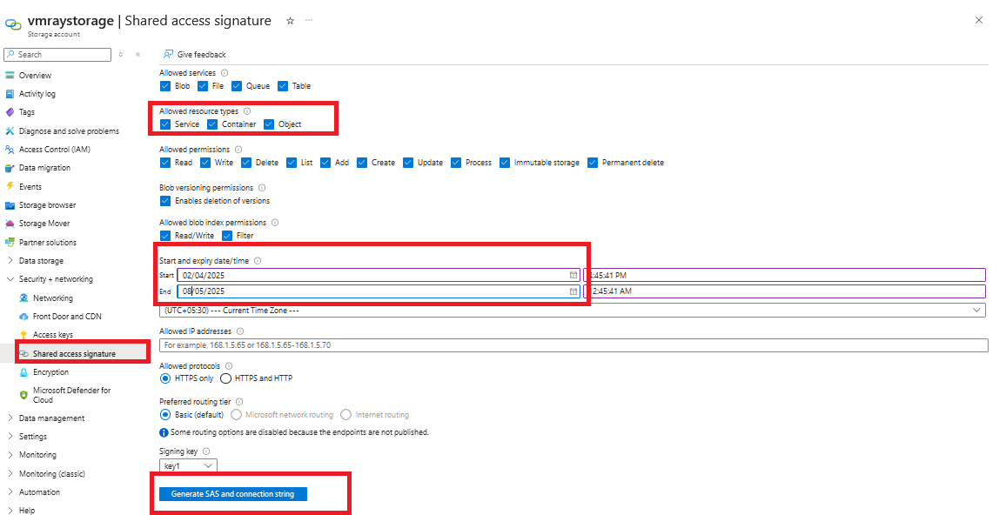

# Microsoft Defender for Endpoint Connector for VMRay Advanced Malware Sandbox

**Latest Version:** 1.1 - **Release Date:** 10/31/2023

## Overview

This project is an integration between Microsoft Defender for Endpoint and VMRay products: Analyzer, FinalVerdict and Totalinsight. 
The connector will collect alerts and related evidences, and query or submit these samples into VMRay Sandbox.
It accelerates the triage of alerts by adding comments to the alert in MS Defender Console with the analysis of the sample.
It also retrieves IOC values from VMRay and submits them into Microsoft Defender for Endpoint.

## Project Structure

    app                                            # Main project directory
    ├─── config                                    # Configuration directory
    │   └─── __init__.py 			
    │   └─── conf.py                               # Connector configuration file
    ├─── db                                        # Directory for SQLite3 database
    ├─── downloads                                 # Directory for extracted binaries
    ├─── lib                                       # Library directory
    │   └─── __init__.py 				
    │   └─── MicrosoftDefender.py                  # Microsoft Defender 
    │   └─── Upload_quarantine_files_blob.ps1      # Uploading quarantine files to MS blob
    for Endpoint API functions
    │   └─── VMRay.py                              # VMRay API functions
    │   └─── Models.py                             # Helper classes for data processing
    │   └─── Database.py                           # Helper classes for database
    ├─── log                                       # Log directory for connector
        └─── microsoft-defender-connector.log      # Log file for connector
    └─── __init__.py
    └─── connector.py                              # Main connector application
    └─── requirements.txt                          # Python library requirements

## Requirements
- Python 3.x with required packages ([Required Packages](app/requirements.txt))
- Microsoft Defender for Endpoint
- VMRay Analyzer, VMRay FinalVerdict, VMRay TotalInsight
- Docker (optional)

## Installation

Clone the repository into a local folder.

    git clone https://github.com/vmray/ms-defender-ep-vmray-connector.git

Install the requirements.

    pip install -r requirements.txt

Update the [conf.py](app/config/conf.py) file with your specific configurations.

## Microsoft Defender for Endpoint Configurations

### Creating Application for API Access

- Open [https://portal.azure.com/](https://portal.azure.com) and `Microsoft Entra Domain Services` service

- Click `App registrations`

- Click `New registration button`

- Enter the name of application and select supported account types.

- In the application overview you can see `Application Name`, `Application ID` and `Tenant ID`

- After creating the application, we need to set API permissions for connector. For this purpose,
  - Click `API permissions` tab
  - Click `Add a permission` button
  - Select `APIs my organization uses`
  - Search `WindowsDefenderATP` and click the search result

- On the next page select `Application Permissions` and check permissions according to the table below. And click `Add permissions` button below.

|       Category       |   Permission Name   |    Description   |
|:---------------------|:--------------------|:---------------- |
| Alert                | Alert.Read.All      | Needed to retrieve alerts and related evidence  |
| Alert                | Alert.ReadWrite.All | Needed to enrich alerts with sample information  |
| Machine              | Machine.LiveResponse | Needed to gather evidences from machines |
| Machine              | Machine.Read.All | Needed to retrieve information about machines  |
| Ti                   | Ti.Read.All | Needed to retrieve indicators  |
| Ti                   | Ti.ReadWrite | Needed to retrieve and submit indicators (application specific)|
| Ti                   | Ti.ReadWrite.All | Needed to retrieve and submit indicators (general) |
| Library              | Library.Manage | Needed to upload custom ps1 script for retrieving av related evidences |

Note:
In order to retrieve files quarantined by the MS Defender antivirus (av) engine, we need to run powershell code on the endpoint.
The related credentials must be well secured.

- After setting only the necessary permisions, click the `Grant admin consent for ...` button to approve permissions.

- We need to secrets to access programmatically. For creating secrets
  - Click `Certificates & secrets` tab
  - Click `Client secrets` tab
  - Click `New client secret` button
  - Enter description and set expiration date for secret

- Use Secret `Value` and `Secret ID` to configure connector.

**Reference**
- [https://docs.microsoft.com/en-us/microsoft-365/security/defender-endpoint/api-hello-world](https://docs.microsoft.com/en-us/microsoft-365/security/defender-endpoint/api-hello-world)

### Activating Live Response 

- Open [https://security.microsoft.com](https://security.microsoft.com)
- Open `Settings` page and `Endpoint` tab
- Open `Advanced features`
- Activate `Live Response` and `Live Response for Servers` options

- Edit the 'MicrosoftDefenderConfig' class in [conf.py](app/config/conf.py) file.

| Configuration Item                                             | Description                                                                                          | Default                                                               |
|:---------------------------------------------------------------|:-----------------------------------------------------------------------------------------------------|:----------------------------------------------------------------------|
| `API` > `TENANT_ID`                                            | Azure Active Directory Tenant Id                                                                     |                                                                       |
| `API` > `APPLICATION_ID`                                       | Azure Application ID                                                                                 |                                                                       |
| `API` > `APPLICATION_SECRET_ID`                                | Azure Application Secret ID                                                                          |                                                                       |
| `API` > `APPLICATION_SECRET`                                   | Azure Application Secret                                                                             |                                                                       |
| `API` > `APPLICATION_NAME`                                     | Azure Application Name                                                                               | `VMRayAnalyzerMicrosoftDefenderForEndpointIntegrationApp`             |
| `API` > `AUTH_URL`                                             | Authentication Url to authenticate Azure Active Directory                                            | `https://login.microsoftonline.com/<TENANT_ID>/oauth2/token`          |
| `API` > `RESOURCE_APPLICATION_ID_URI`                          | Resource Application ID Uri to authenticate Azure Active Directory                                   | `https://api.securitycenter.microsoft.com`                            |
| `API` > `URL`                                                  | URL to access Microsoft Defender for Endpoint API                                                    | `https://api.securitycenter.microsoft.com`                            |
| `DOWNLOAD` > `DIR`                                             | Download directory name                                                                              | `downloads`                                                           |
| `ALERT` > `SEVERITIES`                                         | Selected Alert severities for filtering                                                              | [`UnSpecified`, `Informational`, `Low`, `Medium`, `High`]             |
| `ALERT` > `STATUSES`                                           | Selected Alert statuses for filtering                                                                | [`Unknown`, `New`, `InProgress`, `Resolved`]                          |
| `ALERT` > `EVIDENCE_ENTITY_TYPES`                              | Selected Evidence entity types for filtering                                                         | [`File`]                                                              |
| `ALERT` > `MAX_ALERT_COUNT`                                    | Max alert count per request                                                                          | `10000`                                                               |
| `MACHINE_ACTION` > `JOB_TIMEOUT`                               | Specific machine action job timeout as seconds                                                       | `180`                                                                 |
| `MACHINE_ACTION` > `MACHINE_TIMEOUT`                           | Machine action timeout for machine itself                                                            | `300`                                                                 |
| `MACHINE_ACTION` > `SLEEP`                                     | Sleep time for waiting the jobs as seconds                                                           | `30`                                                                  |
| `INDICATOR` > `ACTIVE`                                         | Indicator submission status [`True`/`False`]                                                         | `True`                                                                |
| `INDICATOR` > `ACTION`                                         | Action for indicators which created by connector                                                     | `Audit`                                                               |
| `INDICATOR` > `TITLE`                                          | Title for indicators which created by connector                                                      | `Indicator based on VMRay Analyzer Report`                            |
| `INDICATOR` > `DESCRIPTION`                                    | Description for indicators which created by connector                                                | `Indicator based on VMRay Analyzer Report`                            |
| `EDR_ENRICHMENT` > | `ACTIVE`                                                                                             | Endpoint Detection Response module enrichment status [`True`/`False`] |
| `EDR_ENRICHMENT` > | `SELECTED_SECTIONS`                                                                                  | Selected sections for enrichment comments                             |
| `AV_ENRICHMENT` > | `ACTIVE`                                                                                             | Anti Virus module enrichment status [`True`/`False`]                  |
| `AV_ENRICHMENT` > | `SELECTED_SECTIONS`                                                                                  | Selected sections for enrichment comments                             |
| `INGESTION` > | `EDR_BASED_INGESTION`                                                                                | Enable or Disable ingestion from EDR module of MDE [`True`/`False`]   |
| `INGESTION` > | `AV_BASED_INGESTION`                                                                                 | Enable or Disable ingestion from AV module of MDE [`True`/`False`]    |
| `TIME_SPAN`                                                    | Alert polling time span as seconds                                                                   | `3600`                                                                |
| `RETRY_LIVE_DELAY`                                             | Delay or waiting time(in seconds) between consecutive attempts when trying to perform a live response operation. | 30                                                                    |                                                                    
| `MAX_LIVE_RETRY`                                               | Defines the maximum number of retry attempts for live response operations                            | 3                                                                     |
| `RETRY_GET_EVE_DELAY`                                          | Defines the delay (in seconds) between each retry attempt when fetching evidences                    | 20                                                                    |                                                                    
| `MAX_GET_EVE_RETRY`                                            | Defines the maximum number of retry attempts for retrieving evidences                                | 3                                                                     |

### Creating a Microsoft Blob Storage account for uploading quarantined files to MS Blob.

- Open [https://portal.azure.com/](https://portal.azure.com) and `Storage accounts` service

- Click `Containers`

- Click `New Container` and give Container Name and click on `create`

- Go to `Security + networking` -> `Access keys`, Copy `Connection string` and save it temporarily for next steps.

- Go to `Security + networking` -> `Shared access signature`, check all the options under `Allowed resource types`, provide `End`(expiration time, preferred 06 months), click on `Generate SAS and connection string`.

- Copy `Store the SAS token` in the PowerShell script and prepend a '?' before the key, like this: `$signedAuthorizationKey = '?abcd1234'`

 Configuration MS BLOB  (MicrosoftDefenderConfig)     [conf.py](app/config/conf.py) file. | Description                  | Default                            |
|:-----------------------------------------------------------------------------------------|:-----------------------------|:-----------------------------------|
| `ACCOUNT_NAME` > `ACCOUNT_NAME`                                                          | Azure BLOB ACCOUNT NAME      | `accounname`                       |
| `CONTAINER_NAME` > `CONTAINER_NAME`                                                      | Azure BLOB CONTAINER NAME    | `storage`                          |
| `CONNECTION_STRING` > `CONNECTION_STRING`                                                | Azure BLOB CONNECTION STRING | `DefaultEndpointsProtocol=xyzm=jj` |

## VMRay Configurations

The VMRay API key will be utilized to retrieve the analysis results.
Create VMRay API key by following the steps below:
  1. Create a user dedicated for this API key (to avoid that the API key is deleted if an employee leaves)
  2. Create a role that allows to "View shared submission, analysis and sample" and "Submit sample, manage own jobs, reanalyse old analyses and regenerate analysis reports".
  3. Assign this role to the created user
  4. Login as this user and create an API key by opening Settings > Analysis > API Keys

- Edit the `VMRayConfig` class in [conf.py](app/config/conf.py) file.

| Configuration Item  | Description                                                                                          | Default                                                                  |
|:--------------------|:-----------------------------------------------------------------------------------------------------|:-------------------------------------------------------------------------|
| `API_KEY_TYPE`| Enum for VMRay API Key Type [`REPORT`/`VERDICT`]                                                     | `REPORT`                                                                 |
| `API_KEY`| Connector API Key                                                                                    |                                                                          |
| `URL`| URL of VMRay instance                                                                                | `https://eu.cloud.vmray.com`                                             |
| `SSL_VERIFY`| Enable or disable certificate verification [`True`/`False`]                                          | `True`                                                                   |
| `SUBMISSION_COMMENT`| Comment for submitted samples                                                                        | `Sample from VMRay Analyzer - Microsoft Defender for Endpoint Connector` |
| `SUBMISSION_TAGS`| Tags for submitted samples                                                                           | `MicrosoftDefenferForEndpoint`                                           |
| `ANALYSIS_TIMEOUT`| Timeout for submission analyses as seconds                                                           | `120`                                                                    |
| `ANALYSIS_JOB_TIMEOUT`| Timeout for analysis job in wait_submissions as seconds                                              | `300`                                                                    |
| `VMRAY_RETRY_DELAY` | The amount of time (in seconds) to wait between retry attempts when submitting samples to VMRay      | 30                                                                       |
| `VMRAY_MAX_RETRY` | The maximum number of retry attempts the system will make when submitting samples to VMRay in case of failure                                               | 3                                                                        |

## General Connector Configurations

- Edit the `GeneralConfig` class in [conf.py](app/config/conf.py) file.

| Configuration Item  | Description       | Default |
|:--------------------|:-----------------------------------|:-------------|
| `LOG_FILE_PATH`| Connector log file path | `microsoft-defender-connector.log` |
| `LOG LEVEL`| Logging verbosity level | `INFO` |
| `SELECTED_VERDICTS`| Selected verdicts to analyze | `suspicious,malicious` |
| `TIME_SPAN`| Time span between script iterations as seconds | `300` |
| `RUNTIME_MODE`| Runtime mode for script | `DOCKER` |

## Database Configurations

- Edit the `DatabaseConfig` class in [conf.py](app/config/conf.py) file.

| Configuration Item  | Description         | Default                |
|:--------------------|:--------------------|:-----------------------|
| `DB_DIR`| Database directory  | `db`                   |
| `DB_PATH`| Database file path  | `db.sqlite3`                 |
| `TABLE_NAME`| Database table name | `alert_evidences` |

## IOC Configurations

- Edit the `IOC_FIELD_MAPPINGS` in [conf.py](app/config/conf.py) file. You can enable or disable IOC types with comments.

| IOC Type | Description | Microsoft Defender for Endpoint Field Names |
|:--------------------|:-----------------------------------|:-------------|
| `ipv4`| Connected IPV4 address | `IpAddress` |
| `sha256`| SHA256 Hash value of file | `FileSha256` |
| `domain`| Connected domain | `DomainName` |
| `sha1`| SHA1 Hash value of file | `FileSha1` |
| `md5`| MD5 Hash value of file | `FileMd5` |

## Powershell Script Configuration

- Set the `$signedAuthorizationKey` variable in [Upload_quarantine_files_blob.ps1](app/lib/Upload_quarantine_files_blob.ps1) file with SAS token. This script automatically uploads to MS blob evidences that is quarantined by the Antivirus module of Microsoft Defender for Endpoint.

# Running the Connector

## Running with CLI

You can start connector with command line after completing the configurations. You need to set `RUNTIME_MODE` as `RUNTIME_MODE.CLI` in the `GeneralConfig`. Also you can create cron job for continuous processing.

    python connector.py

## Running with Docker

You can create and start Docker image with Dockerfile after completing the configurations. You need to set `RUNTIME_MODE` as `RUNTIME_MODE.DOCKER` in the `GeneralConfig`.

    docker build -t mde_connector .
    docker run -d -v $(pwd)/log:/app/log -v $(pwd)/db:/app/db -t mde_connector

After running the Docker container you can see connector logs in the log directory on your host machine.

-------------------------------------------------------------------------------------------------------------------------
## Version 2.0 Release Notes:

1. **File Quarantine and Upload Process**
     - Extract Quarantined Files from Microsoft Defender
     - Upload Files to Microsoft Blob Storage
     - Retrieve Files from Microsoft Blob Storage
     - Submit Files to VMRay for Analysis
     - Folder Existence Check and Cleanup
    
3. **Error Handling, Retry Logic, and Logging**
      - Error Handling
      - Retry Logic
      - Logging
    
5. **Debugging**
      - Logs

## 1. Release Notes - File Quarantine and Upload Process
**Overview**

This update focuses on the process of extracting quarantined files from Microsoft Defender, uploading those files to Microsoft Blob Storage, retrieving the files from the Blob, and submitting them for analysis to VMRay. The process includes a series of key steps that ensure proper handling, uploading, and submission of quarantine files, including validation, error handling, and retries.

**Key Highlights:**

- **Extract Quarantined Files from Microsoft Defender**
  - The system extracts files marked as quarantined in Microsoft Defender for Endpoint.
  - The files are stored temporarily on the local system and ready for upload.

- **Upload Files to Microsoft Blob Storage**
  - Once the files are extracted, they are uploaded to Microsoft Blob Storage.
  - The script accepts the following parameters for upload:
     - **accountName**: The Azure storage account name.
     - **containerName**: The name of the Blob container where the files are uploaded.
     - **evidences**: A list of the files to be uploaded.
  - The upload process ensures that the files are stored securely in Azure Blob storage for further processing.

- **Retrieve Files from Microsoft Blob Storage**
   - The system fetches the files stored in the specified Azure Blob container.
   - It retrieves the necessary blobs for submission to VMRay based on the provided containerName and accountName.

- **Submit Files to VMRay for Analysis**
  - The retrieved files are submitted to VMRay for malware analysis.
  - The script includes mechanisms for retrying failed submissions, ensuring reliability in case of intermittent issues.

- **Folder Existence Check and Cleanup**
    - Before starting the process, the script checks if the quarantine folder already exists. If it exists, it is deleted to avoid conflicts.
    - After the files are submitted, the folder is cleaned up to ensure that no leftover files remain in the system.
    - Final cleanup ensures that the temporary folder used for storage is removed once the process is complete.

## 2. Release Notes - Error Handling, Retry Logic, and Logging

**Overview**

This update introduces error handling, retry logic, and detailed logging to improve the reliability and 
traceability of the connector working process. These enhancements ensure that the system can recover 
from transient failures, log useful information for troubleshooting, and gracefully handle unexpected errors 
during execution.

- **Error Handling:**

  - Comprehensive Error Detection: The system includes checks to identify issues such as missing files, network interruptions, or permission errors during various stages of the process (file extraction, upload, and submission).
  - Custom Error Messages: Meaningful error messages are logged, providing specific details on what went wrong (e.g., "File not found", "Network timeout", "Permission denied").

- **Retry Logic:**

  - Automatic Retries: For operations that may fail due to transient issues (e.g., network connectivity problems), the system implements a retry mechanism. The script attempts the operation multiple times before logging an error and exiting.
  - Configurable Retry Count and Delay: The number of retries and the delay between attempts can be adjusted via configuration settings, allowing flexibility in handling intermittent issues.

- **Logging:**

  - Detailed Logging: The system logs key steps, success and failure messages, and any relevant data during the entire execution flow.
      
  - Log Levels: Different log levels (e.g., INFO, DEBUG, WARNING,  ERROR) are used to categorize log messages. This helps in filtering logs and finding relevant information easily during troubleshooting.

## 3. Debugging
- **Logs**
  - All logs will be stored in the log/microsoft-defender-connector.log file. This log provides detailed information about the connector's operations and can be used to track its progress and troubleshoot any issues.
